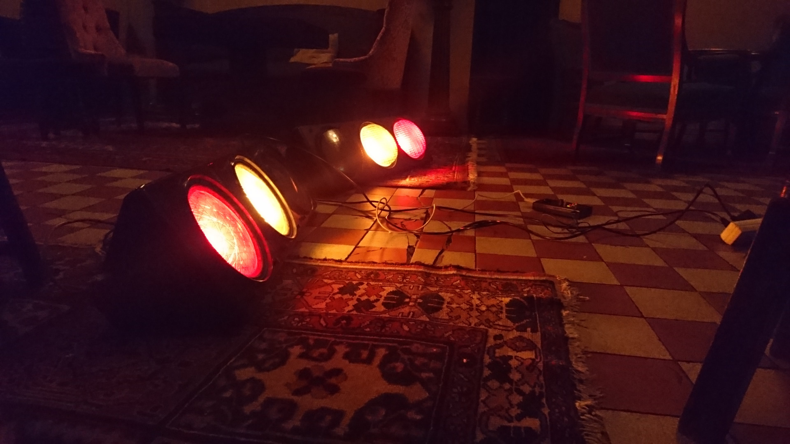
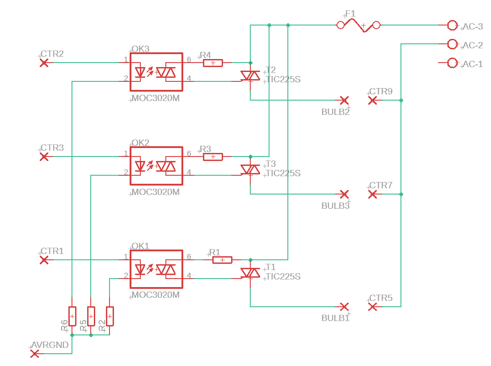

# Lights Controller (Light Organ)

This project is about controlling lights (ordinary 40W light bulbs) as a "light organ". For my specific use case, the lights in question are old traffic lights, containing three E27 light bulb sockets. The project is split into two parts; a controller unit, and a driver unit. And soon there will also be an app :-)

 

## Version 1
### Controller Unit

The controller unit consists of a microcontroller which emits a signal to control the flashing of the lights (which lights to flash, and in what tempo/frequency). Version 1 of the project uses an ATMEGA88, mounted inside a discarded hand held controller unit for some scientific device. Buttons control the program (i.e. pattern of lights to blink), and the programs are emit simply as a series of bytes (where a bit directly maps to a corresponding light). The tempo is varied by a potentiometer, which sets the delay in the main loop of the embedded software. This means the lights are mapped directly to the pins of one of the ports on the microcontroller.

 

### Driver Unit

The driver unit is connected physically (via serial cable) to the controller unit, and -- since the lights happen to be traffic lights -- connects to 3 bits of the emitted signal. An optoisolator insulates the TTL logic of the received signal from the mains voltage side of the driver unit ([based on this design](https://hmmtheresanidea.blogspot.com/2008/09/triac-mains-switching.html?m=1)), where the mains voltage is toggled on/off using a triac. Solid state triacs allow extremely fast switching, compared to, say, a relay. I am a bit anticipatory of how well this will work using modern LED bulbs, but it works great with incandescent bulbs. 

 

## Version 2
### Controller Unit

In the updated version of this project, I'm working towards splitting the controller unit into two parts; a mobile app, and (several) wireless receiver units -- one per light unit (traffic light). The receiver unit will consist of an ESP8266 wifi unit (to receive data) and an ATMEGA16 microcontroller (to communicate with the driver unit, as before). The new receiver is designed such as to store the current "program" (bytes to blink) in memory, as well as a frequency of which to blink. A timer (the 16-bit Timer1 in CTC mode) is used to step the program and emit the current byte.

The mobile app will replace the handheld controller, in communicating the current "program" (blinking pattern) and tempo. The mobile app will have to be on the same network as the receiver/driver units, and communications will be over TCP/IP. A protocol is designed such that the app may transmit different information to the receivers:

- the program to emit (a series of bytes, which will be buffered in memory)
- a `RESET` command (which copies the receive buffer into the program buffer)
- a `TEMPO` command (which sets the current tempo of the timer/interrupt)

### Driver Unit

The aim is to re-use the same driver unit as before (connected directly to the receiver unit containing the ESP8266).
